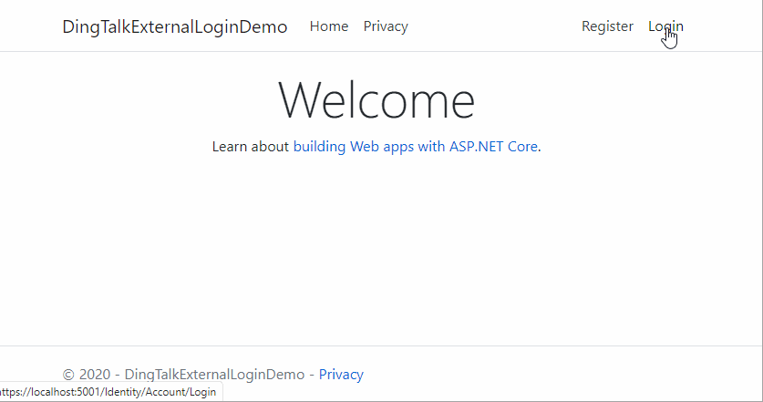

[](https://www.nuget.org/packages/Charlie.AspNetCore.Authentication.DingTalk/)

提供钉钉外部扫码登陆，用于集成到 Asp.Net Core Identity。



## v2.0 版本
### 与上一个版本的区别：
1. 允许开发者只提供 钉钉扫码登录 的 AppKey、Secret。不再要求必须提供 钉钉内部小程序的 AppKey、Secret。（详见 <前提>）
1. `DingTalkOptions` 中原 `ClientId` 现用于表示 钉钉扫码登录 的 AppKey，原 `ClientSecret` 现在用于表示 钉钉扫码登录的 AppSecret
1. `DingTalkOptions` 中原 `QrLoginAppId`、`QrLoginAppSecret` 被废弃
1. `DingTalkOptions` 中新增 `IncludeUserInfo` 表示是否包含该用户在企业内的用户信息（如：UserId、姓名、手机号、工号等）
1. `DingTalkOptions` 中新增 `AppKey` 用于表示 企业内部开发小程序的 App Key、`AppSecret` 表示 企业内部开发小程序的 App Secret（注，这两个仅当 `IncludeUserInfo` 为 `true` 才需要必填）
1. 提供 `DingTalkClaimTypes` 用于定义钉钉返回的用户信息（仅当 `IncludeUserInfo` 为 `true`）

### 前提   
1. 开发者自行在钉钉开发者平台中注册 **企业内部应用-小程序** （可选）
1. 开发者自行在钉钉开发者平台中注册 **移动接入应用-登陆**

### 基本用法差异   
1. 引入 nuget package: `Install-Package Charlie.AspNetCore.Authentication.DingTalk `
2. 修改原 `AddDingTalk` 的配置
```csharp
services.AddAuthentication()
    .AddDingTalk(opts =>
    {
        opts.ClientId = 钉钉扫码登录 的 AppKey
        opts.ClientSecret = 钉钉扫码登录的 AppSecret;
        
        opts.IncludeUserInfo = 是否包含该用户在企业内的用户信息;        
        opts.AppKey = 企业内部开发小程序的 App Key;
        opts.AppSecret = 企业内部开发小程序的 App Secret;
     }
```
 
#### 获得钉钉返回的用户信息
1. 右键单击项目，选择 **添加-新搭建基架的项目...**，然后选择 **标识**，在弹出框中，选择 **Account\ExternalLogin**。这个步骤会在项目中创建 Asp.Net Core Identity 的 **ExternalLogin** Razor Page
1. 在 **ExternalLogin.cshtml.cs** 中的 `OnPostConfirmationAsync` 方法里，当 `AddLoginAsync` 成功后，可以通过 `info.Prinicpal.Claims` 获取钉钉返回的所有 Claim。开发者可以自行决定如何使用这些 Claim，如：
```csharp
    public async Task<IActionResult> OnPostConfirmationAsync(string returnUrl = null)
    {
        // 省略部分无关代码
        result = await _userManager.AddLoginAsync(user, info);
        if (result.Succeeded)
        {
            _logger.LogInformation("User created an account using {Name} provider.", info.LoginProvider);

            // 增加来自于 DingTalk 的额外的 claim
            await _userManager.AddClaimsAsync(user, info.Principal.Claims);
            
            //省略部分无关代码
          }
      }
```
#### 钉钉返回的 Claim 
```csharp
    /// <summary>
    /// 钉钉特有的 Claim
    /// </summary>
    public static class DingTalkClaimTypes
    {
        /// <summary>
        /// 员工在当前开发者企业账号范围内的唯一标识
        /// </summary>
        public const string UnionId = "urn:dingtalk:unionid";

        /// <summary>
        /// 员工工号
        /// </summary>
        public const string JobNumber = "urn:dingtalk:jobno";

        /// <summary>
        /// 职位信息
        /// </summary>
        public const string Position = "urn:dingtalk:position";

        /// <summary>
        /// 是否是高管
        /// </summary>
        public const string IsSenior = "urn:dingtalk:is_senior";

        /// <summary>
        /// 员工的企业邮箱
        /// </summary>
        public const string OrgEmail= "urn:dingtalk:ogr_email";

        /// <summary>
        /// 是否实名认证
        /// </summary>
        public const string RealAuthed = "urn:dingtalk:real_authed";

        /// <summary>
        /// 是否是老板
        /// </summary>
        public const string IsBoss = "urn:dingtalk:is_boss";

        /// <summary>
        /// 是否为企业的管理员
        /// </summary>
        public const string IsAdmin = "urn:dingtalk:is_admin";

        /// <summary>
        /// 在对应的部门中是否为主管：Map结构的json字符串，key是部门的id，value是人员在这个部门中是否为主管，true表示是，false表示不是
        /// </summary>
        public const string IsLeaderInDepts = "urn:dingtalk:is_leader_in_depts";

        /// <summary>
        /// 入职时间。Unix时间戳
        /// </summary>
        public const string HiredDate = "urn:dingtalk:hired_date";

        /// <summary>
        /// 扩展属性
        /// </summary>
        public const string Extattr = "urn:dingtalk:ext_attr";
    }
```


## v1.0 版本
### 前提   
1. 开发者自行在钉钉开发者平台中注册 **企业内部应用-小程序** 
1. 开发者自行在钉钉开发者平台中注册 **移动接入应用-登陆**

### 基本用法   
1. 引入 nuget package: `Install-Package Charlie.AspNetCore.Authentication.DingTalk -Version 1.0.4`
2. 增加如下代码
```csharp
services.AddAuthentication()
    .AddDingTalk(opts =>
    {
        opts.ClientId = 钉钉小程序的 ClientId, 用于访问钉钉企业中的用户数据; 钉钉访问用户信息的时候需要使用
        opts.ClientSecret = 钉钉小程序的 ClientSecret;

        opts.QrLoginAppId = 钉钉登陆的 AppId;
        opts.QrLoginAppSecret = 钉钉登陆的 AppSecret;
     }
```

### 具体使用方法   
下面以2种扫码方式进行分别说明
#### 使用钉钉自带的扫码页面   
1. 创建一个 Asp.Net Core Web 应用程序（MVC)
1. 修改**身份验证**，选择 **个人用户账户**
1. 在 `Startup.cs` 的 `ConfigureServices` 中，增加如下代码：
   ```csharp
    services.AddAuthentication()
        .AddDingTalk(opts =>
        {
            opts.ClientId = 钉钉小程序的 ClientId, 用于访问钉钉企业中的用户数据;
            opts.ClientSecret = 钉钉小程序的 ClientSecret;

            opts.QrLoginAppId = 钉钉登陆的 AppId;
            opts.QrLoginAppSecret = 钉钉登陆的 AppSecret;
         }
    ```

#### 使用自定义的扫码页面
相比钉钉自带的扫码页面，使用自定义页面需要额外几个步骤
1. 【同上】创建一个 Asp.Net Core Web 应用程序（MVC)
1. 【同上】修改**身份验证**，选择 **个人用户账户**
1. 右键单击项目，选择 **添加-新搭建基架的项目...**，然后选择 **标识**，在弹出框中，选择 **Account\Login**。这个步骤会在项目中创建 Asp.Net Core Identity 的 **Login** Razor Page
1. 在 **Areas\Identity\Pages\Account** 目录中，添加一个 **DingTalkLogin** Razor Page。这个 Page 就是用来渲染自己的 QR 页面，在 **cshtml** 中加入：
   ```javascript
    <script src="https://g.alicdn.com/dingding/dinglogin/0.0.5/ddLogin.js"></script>
    <script>
        var dingtalk = "https://oapi.dingtalk.com/connect/oauth2/sns_authorize?appid=@(Model.AppId)&response_type=@(Model.ResponseType)&scope=@(Model.Scope)&state=@(Model.State)&redirect_uri=@(Model.RedirectUri)";

            DDLogin({
                id: "code-img",
                goto: encodeURIComponent(dingtalk),
                style: "border:none;background-color:#FFFFFF;margin-top:-40px;",
                width: "400",
                height: "300"
            });
            var handleMessage = function (event) {
                if (event.origin == "https://login.dingtalk.com") {
                    window.top.location.href = dingtalk + "&loginTmpCode=" + event.data;
                }
            };
            if (typeof window.addEventListener != 'undefined') {
                window.addEventListener('message', handleMessage, false);
            } else if (typeof window.attachEvent != 'undefined') {
                window.attachEvent('onmessage', handleMessage);
            }

    </script>
    ```
1. 修改 **Areas\Identity\Pages\Account** 目录中的 Login.cshtml, 增加一个 Iframe 用于显示扫码页面：
   ```html
       <div style="height:300px">
            <form id="external-account" asp-page="./ExternalLogin" asp-route-returnUrl="@Model.ReturnUrl" method="post" target="ifmDingTalk" style="display:none">
                <div>
                    <p>
                        <button id="dingTalkLoginBtn" type="submit" class="btn btn-primary" name="provider" value="DingTalk"></button>
                    </p>
                </div>
            </form>
            <iframe name="ifmDingTalk" scrolling="no" style="width:450px;height:300px">
            </iframe>
        </div>
       
        @section Scripts {
            <script>
                $("#dingTalkLoginBtn").click();
            </script>
        }

   ```
1. 修改 `Startup.cs` 在 `ConfigureServices` 中增加:
   ```
    services.AddAuthentication().AddDingTalk(opts =>
    {
        opts.ClientId = dingTalkOpts.ClientId;
        opts.ClientSecret = dingTalkOpts.ClientSecret;

        opts.QrLoginAppId = dingTalkOpts.QrLoginAppId;
        opts.QrLoginAppSecret = dingTalkOpts.QrLoginAppSecret;


        opts.SignInScheme = IdentityConstants.ExternalScheme;

        // 由于是使用自己的 扫码 页面，则必须定义自己的 授权节点
        opts.AuthorizationEndpoint = "/Identity/Account/DingTalkLogin";

        // 演示如何把外部登陆的错误信息显示在 Razor Page 上
        opts.Events.OnRemoteFailure = async ctx =>
        {
            var tempDataProvider = ctx.HttpContext.RequestServices.GetRequiredService<ITempDataProvider>();

            tempDataProvider.SaveTempData(ctx.HttpContext, new Dictionary<string, object>
                    {
                        { "ErrorMessage",ctx.Failure.Message }
                    });
            ctx.Response.Redirect("/Identity/Account/Login");
            ctx.HandleResponse();

            await Task.CompletedTask;
        };
    });
    ```
   
#### Demo
详见解决方案中对应的 Demo 项目
   
